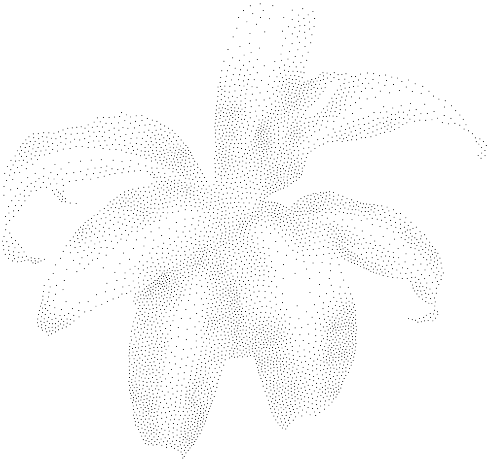
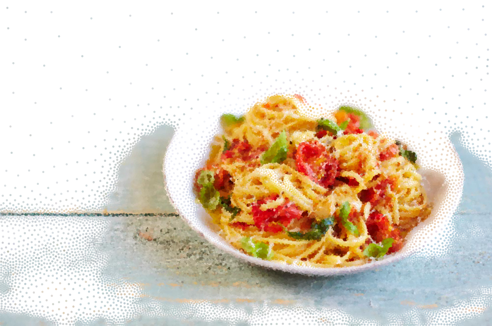

# pointu

pointu is a tool to render images with points of varying sizes and colors in an artistic way. The implementation is based on [Adrian Secord](https://cs.nyu.edu/~ajsecord/)'s 2002 [paper](https://mrl.nyu.edu/~ajsecord/npar2002/npar2002_ajsecord_preprint.pdf) entitled *Weighted Voronoi Stippling*. The name *pointu* is derived from [*pointillism*](https://www.wikiwand.com/en/Pointillism), a painting technique in which points are used to form an image.

## Installation

1. [Install Go](https://golang.org/doc/install)
2. Make sure that `$GOPATH` is set and that `$GOPATH/bin` has been added to the global path
3. Run `go get -u github.com/MaxHalford/pointu`
4. Run `pointu -help` to check that the installation was successful

## Examples

```sh
pointu -in examples/originals/plant4h.png -out examples/processed/plant4h.png -points 5000
```

Original            |  Processed
:-------------------------:|:-------------------------:
  |  


```sh
pointu -in examples/originals/plant2_400x400.png -out examples/processed/plant2_400x400.png -points 10000 -rmin 0.5 -rmax 0.5
```

Original            |  Processed
:-------------------------:|:-------------------------:
  |  


```sh
pointu -in examples/originals/figure5_525x525.png -out examples/processed/figure5_525x525.png -points 3000 -rmax 2
```

Original            |  Processed
:-------------------------:|:-------------------------:
  |  

```sh
pointu -in examples/originals/shoe_1300x1300_org.png -out examples/processed/shoe_1300x1300_org.png -points 5000 -iterations 100 -rmin 2 -rmax 3
```

Original            |  Processed
:-------------------------:|:-------------------------:
  |  

```sh
pointu -in examples/originals/bird.jpg -out examples/processed/bird.png -points 60000 -iterations 15 -rmin 2 -rmax 3 -color
```

Original            |  Processed
:-------------------------:|:-------------------------:
  |  

```sh
pointu -in examples/originals/pasta.jpg -out examples/processed/pasta.png -points 80000 -iterations 15 -rmin 2 -rmax 3 -resolution 4 -color
```

Original            |  Processed
:-------------------------:|:-------------------------:
  |  


## Usage

Run `pointu -h` to get a list of available parameters.

## Implementation details

Please check out this [blog post](https://maxhalford.github.io/blog/halftoning-with-go---part-2/) for some details on the implementation.

## License

The MIT License (MIT). Please see the [license file](LICENSE) for more information.
